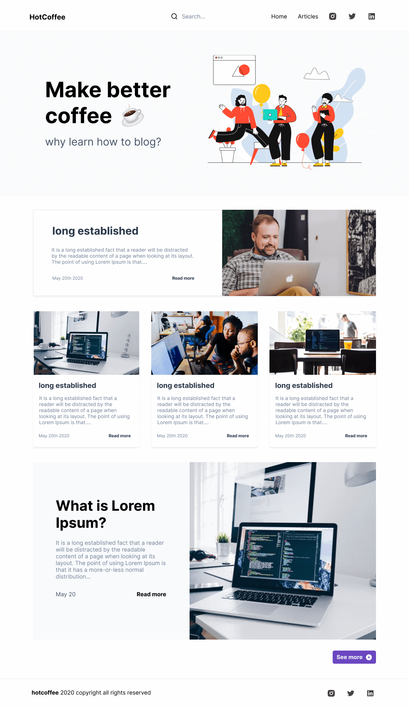

<h1 align="center">Blog with CMS</h1>

<p align="center">	
   <a href="https://www.linkedin.com/in/rafael-goulartb/">
      
   </a>
  <a href="https://github.com/RafaelGoulartB/blog-cms#readme">
    
  </a>
  <a href="https://github.com/RafaelGoulartB/blog-cms/graphs/commit-activity">
    
  </a>
  <a href="https://github.com/RafaelGoulartB/blog-cms/blob/master/LICENSE">
    
  </a>
  
  
  
</p>

> Blog made with Next.js and GraphCMS

<div align="center">
  <sub>The Blog project. Built with ❤︎ by
    <a href="https://github.com/RafaelGoulartB">Rafael Goulart</a> and
    <a href="https://github.com/RafaelGoulartB/blog-cms/graphs/contributors">
      contributors
    </a>
  </sub>
</div>

<br />
<div align="center">
  
</div>

---

# :pushpin: Table of Contents

* [Demo Website](#eyes-demo-website)
* [Technologies](#computer-technologies)
* [Features](#rocket-features)
* [How to run](#construction_worker-how-to-run)
* [Found a bug? Missing a specific feature?](#bug-issues)
* [Contributing](#tada-contributing)
* [License](#closed_book-license)

<h2 align="left"> 📥 Layout available at figma community: </h2>
<p align="center">
    <a title="Acess Figma Community" href="https://www.figma.com/community/file/895225371918055740">
        
    </a>
</p>

# :eyes: Demo Website
The demo website can be missing some features, clone and run the project to a full experience. <br>
👉  demo: https://blogcms.vercel.app/

# :computer: Technologies
This project was made using the follow technologies:

* [Next.js](https://nextjs.org/) - To SSR and routes control     
* [Vercel](https://vercel.com/) - To deploy website     
* [GraphCMS](https://graphcms.com/) - To content management

# :rocket: Features

- List Articles
- Show articles
- Edit Articles
- Search
- Pagination
  
# :construction_worker: How to run
### Rename env file
Rename `.env.local-exemple` to `.env.local`
### Install Dependencies
```bash
yarn install
```
### Run Aplication
```bash 
yarn dev 
```

Open [http://localhost:3000](http://localhost:3000) with your browser to see the result.
<br>

# :bug: Issues

Feel free to **file a new issue** with a respective title and description on the the [Blog CMS](https://github.com/RafaelGoulartB/blog-cms/issues) repository. If you already found a solution to your problem, **i would love to review your pull request**!

# :tada: Contributing
First of all, thank you for being interested in helping out, your time is always appreciated in every way. :100:

Here's some tips:

* Check the [issues page](https://github.com/RafaelGoulartB/blog-cms/issues) for already opened issues (or maybe even closed ones) that might already address your question/bug/feature request.
* Feature requests are welcomed! Provide some details on why it would be helpful for you and others, explain how you're using bull-board and if possible even some screenshots if you are willing to mock something!

Check out the [contributing](./CONTRIBUTING.md) page to see the best places to file issues, start discussions and begin contributing.

# :closed_book: License

Released in 2020.
This project is under the [MIT license](./LICENSE).

Made with love by [RafaelGoulartB](https://github.com/RafaelGoulartB) 🚀
